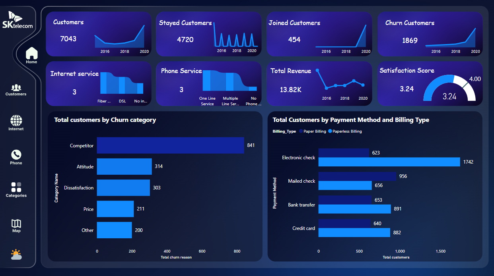

Sk_Telecom Customer Analytics Dashboard
This project is a Telecom Customer Analytics Dashboard that provides a comprehensive analysis of customer behavior, churn trends, service usage, and financial performance metrics. It is designed to empower telecom companies to make data-driven decisions and to enhance customer satisfaction, reduce churn, and increase revenue.

The dashboard visualizes a range of metrics across multiple aspects of the telecom business, including customer retention, churn, revenue, service features, and geographical insights. It is a powerful tool that helps identify areas for improvement and monitor key performance indicators (KPIs) on a continual basis also the Dashboard contain both white and night mode.

Key Features:
1. Customer Overview:
Total Customers: Shows the total number of customers (7,043), categorized into Churned (1,869), Stayed (4,720), and Joined (454) customers. This provides a quick overview of customer movement over time.
Contract Types: Displays how many customers are on month-to-month (3,875), two-year (1,695), or one-year (1,473) contracts. This helps in understanding customer retention over different contract durations.
2. Churn Analysis:
Churn Reasons: The churn reasons are categorized into various factors such as:
Competition: 841 customers churned due to competitors.
Attitude: 314 churned due to dissatisfaction with the company's attitude.
Dissatisfaction: 303 customers churned due to service dissatisfaction.
Price: 211 customers left due to high prices.
Other: 200 customers churned for other reasons.
Churn by Service Type: Visualizes churn based on internet and phone services, making it easier to pinpoint which services lead to higher churn rates.
Churn by Service Features: Breaks down churn for customers using device protection and online backup, showing which service features contribute to churn.
Churned Contracts: Displays churn across different contract types, indicating that most churn occurs in month-to-month contracts (1,655 customers), with lower churn rates in one-year and two-year contracts.
3. Revenue Insights:
Total Revenue: The total revenue stands at 13.82K, segmented across different time frames and service types. The revenue from churned customers accounts for 2.84K.
Revenue by Contract Method: Shows how revenue is distributed across different contract methods, with month-to-month contracts generating the highest revenue (7.0K).
Revenue by Service Type: Shows revenue from different phone and internet services (e.g., multiple line services contributing 7.1K in revenue, one-line service 5.5K, and no phone service 1.2K).
Revenue Trends: Tracks total revenue over the years from 2015 to 2020, indicating positive growth after customer churn.
4. Service Features and Customer Segmentation:
Total Customers by Service Feature: Customers are categorized based on the services they subscribe to:
Unlimited Data: 4.4K customers.
Streaming Services: 2.5K customers each for streaming movies, TV, and music.
Online Backup, Device Protection, and Security: Around 2.2K to 1.9K customers for each of these features.
Service Usage Insights: Visualizes which services have the most adoption, helping the telecom company prioritize its offerings.
5. Geographical Distribution:
Customer Distribution by City: A bar chart showing total customers by city, with Oakland having the highest number (313), followed by San Diego (164) and Sacramento (108).
Total Monthly Charges by City: A geographical map highlights the distribution of total monthly charges across various cities in California, offering insights into regional revenue performance.
6. Payment and Billing Analysis:
Billing Type: Shows the distribution of customers using paper versus paperless billing.
Payment Method: Visualizes the number of customers paying via electronic check, mailed check, bank transfer, or credit card, with electronic checks being the most popular method (2,365 customers).
Revenue Breakdown by Billing Method: Analyzes how much revenue comes from customers with paper or paperless billing.
7. Satisfaction Metrics:
Satisfaction Score: Displays the average customer satisfaction score (3.24 out of 5), giving a snapshot of how satisfied customers are with the company's services.
Marital Status Segmentation: An additional filter to analyze customer satisfaction and churn rates based on marital status.
8. Phone and Internet Service Insights:
Phone Service Types: Breakdown of customers using different phone service types (one-line service, multiple-line service, and no phone service).
Internet Service Types: Analysis of customers using fiber optic, DSL, or no internet service, with fiber optic being the dominant service.
Customers by Phone Service Type and Churned Customers by Year: A year-on-year comparison of customer numbers and churn rates.
Technology Stack:
Microsoft Power BI / Tableau: Interactive dashboards and visual analytics built using business intelligence tools.
Data Sources: The dataset comprises customer information, service usage, billing details, churn reasons, and geographical data.
Business Use Cases:
Churn Management: Identify major factors contributing to churn and focus on retention strategies for high-risk customers.
Revenue Forecasting: Analyze how different contract types and services contribute to overall revenue, helping to focus on the most profitable services.
Customer Segmentation: Segment customers based on service usage, geographical location, and satisfaction levels for targeted marketing.
Service Improvement: Discover trends in service feature adoption and dissatisfaction to refine product offerings and enhance customer experience.
Regional Performance Analysis: Geographical data allows for performance tracking across various cities, providing insights into underperforming regions.
Billing and Payment Insights: Understand customer preferences for payment methods and billing types, allowing the company to tailor its offerings.
Future Development:
Real-Time Data Integration: Enabling real-time insights for more responsive decision-making.
Predictive Analytics: Adding machine learning models to predict customer churn and identify potential areas for revenue growth.
Customer Feedback Loop: Implementing customer feedback mechanisms for real-time satisfaction tracking and service optimization.
This dashboard provides a holistic view of customer interactions with a telecom company, enabling better decision-making and strategic initiatives to drive growth and improve service offerings.

