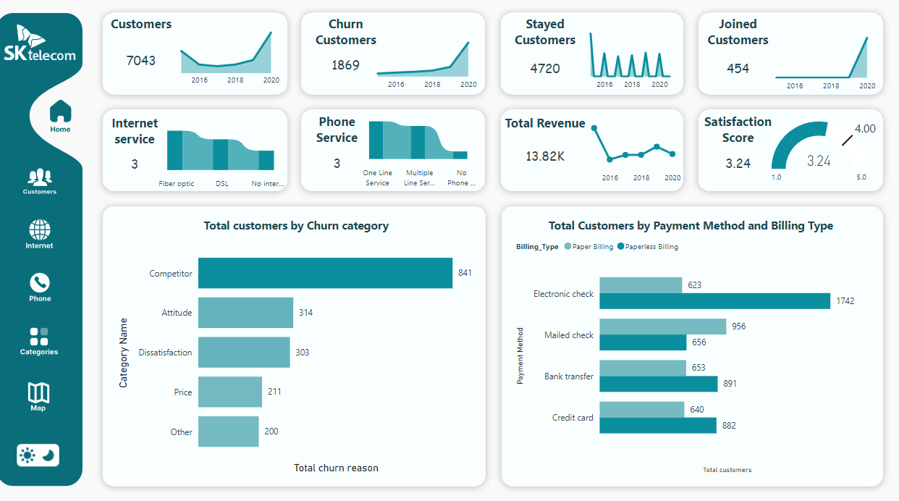

Sk_Telecom Customer Analytics Dashboard
This project is a Telecom Customer Analytics Dashboard that provides a comprehensive analysis of customer behavior, churn trends, service usage, and financial performance metrics. It is designed to empower telecom companies to make data-driven decisions and to enhance customer satisfaction, reduce churn, and increase revenue.

The dashboard visualizes a range of metrics across multiple aspects of the telecom business, including customer retention, churn, revenue, service features, and geographical insights. It is a powerful tool that helps identify areas for improvement and monitor key performance indicators (KPIs) on a continual basis also the Dashboard contain both white and night mode.

